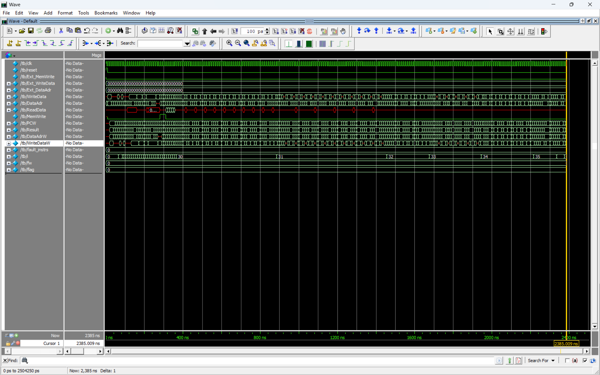

# RISC-V Pipelined CPU

This repository contains the implementation of a **32-bit 5-stage pipelined RISC-V CPU**. The design is based on the RISC-V instruction set architecture (ISA) and features the standard instruction pipeline stages: Fetch, Decode, Execute, Memory Access, and Write Back. The CPU supports all six basic types of instructions: R, I, S, B, U, and J.

## Features

### **Pipeline Stages**

The CPU implements the following 5 pipeline stages:

1. **Instruction Fetch (IF):** Fetches instructions from memory.
2. **Instruction Decode (ID):** Decodes the instruction and reads registers.
3. **Execute (EX):** Performs arithmetic/logic operations or calculates memory addresses.
4. **Memory Access (MEM):** Reads or writes data to memory.
5. **Write Back (WB):** Writes the result back to the register file.

### **Hazard Handling**

The CPU handles data and control hazards using the following techniques:
- **Data Hazards:** Resolved using pipeline registers to perform forwarding and pipeline stalls.
- **Control Hazards:** Resolved using branch prediction and pipeline flushing.

> **Note:** The design does not use a specific forwarding unit. Instead, forwarding is managed through the pipeline registers themselves.

### **Supported Instruction Types**

The CPU supports the following RISC-V instruction types:

| **Instruction Type** | **Instructions**                                                                 |
|-----------------------|---------------------------------------------------------------------------------|
| **R-Type**            | `add`, `sub`, `sll`, `slt`, `sltu`, `xor`, `srl`, `sra`, `or`, `and`           |
| **I-Type**            | `addi`, `slti`, `sltiu`, `xori`, `ori`, `andi`, `lb`, `lh`, `lw`, `lbu`, `lhu` |
| **S-Type**            | `sb`, `sh`, `sw`                                                              |
| **B-Type**            | `beq`, `bne`, `blt`, `bge`, `bltu`, `bgeu`                                    |
| **U-Type**            | `lui`, `auipc`                                                                |
| **J-Type**            | `jal`, `jalr`                                                                 |

All the above instructions are fully implemented and tested.

---

## Module Description

The top-level module has the following inputs and outputs:

| **Signal Name**      | **Direction** | **Description**                                                      |
|-----------------------|---------------|----------------------------------------------------------------------|
| **clk**              | Input         | Clock input for the module.                                          |
| **reset**            | Input         | Reset signal for resetting the module.                              |
| **Ext_MemWrite**     | Input         | External signal indicating memory write operation.                   |
| **Ext_WriteData**    | Input         | External data to be written into data memory.                        |
| **Ext_DataAdr**      | Input         | External address for read/write operation in memory.                 |
| **MemWrite**         | Output        | Signal indicating memory write operation.                            |
| **WriteData**        | Output        | Data to be written into data memory.                                 |
| **DataAdr**          | Output        | Address for read/write operation from/to the data memory.            |
| **ReadData**         | Output        | Data read from the data memory.                                      |
| **PC**               | Output        | Value of the program counter for debugging.                          |
| **Result**           | Output        | ALU result for debugging purposes.                                   |

---

## Architecture Overview

The CPU architecture is designed based on the RISC-V ISA and includes the following major components:

- **Pipeline Registers:** Manage data forwarding and stage isolation.
- **Program Counter (PC):** Tracks the current instruction address.
- **Instruction Memory:** Stores the program instructions.
- **Register File:** Contains 32 general-purpose registers.
- **ALU (Arithmetic Logic Unit):** Performs arithmetic and logical operations.
- **Control Unit:** Decodes instructions and generates control signals.
- **Hazard Detection Unit:** Detects and resolves pipeline hazards (data and control).

Refer to the architecture diagram for further details:  

## Simulation Results

1. **Testbench Output**  
   The CPU has been tested using a comprehensive testbench covering all instruction types and pipeline stages. The output validates correct instruction execution and pipeline behavior.  
   - **Output Signal:**  
     
   - **Output Transcript:**  
     

2. **Pipeline Behavior**
   To better understand the pipelining behavior and its effect on instruction execution, you can use [**Ripes**](https://ripes.me/), an educational tool for simulating RISC-V pipelines. The tool provides a visual representation of the pipeline, showing how instructions move through each stage.

3. **Netlist Viewer**  
   Snapshots from Quartus Prime Netlist Viewer illustrating the CPU architecture:  
   - **CPU Overview:**  
     
   - **The Whole CPU:**
    
   - **Few Components for better clarity:**  
     - CPU:   
     - Controller:   
     - Datapath: 

## Reference Textbook

This design is based on concepts from the following textbook:  
**Digital Design and Computer Architecture: RISC-V Edition** by Sarah L. Harris and David Harris.
